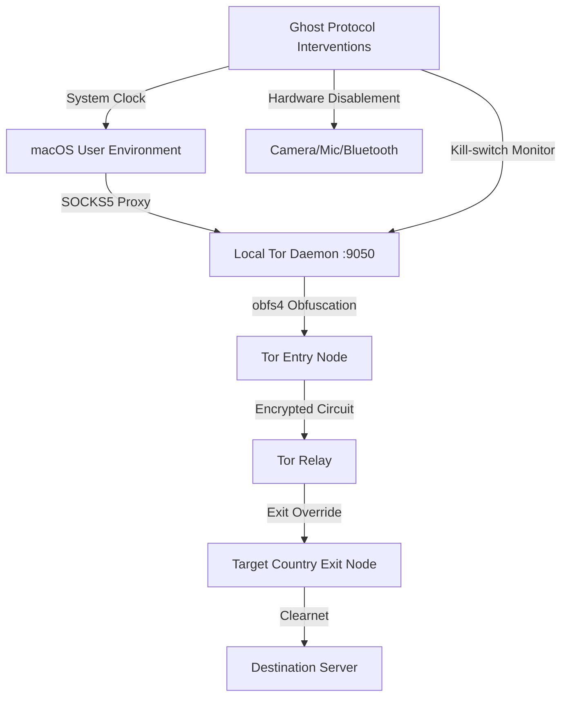

# Ghost Protocol - V3 (Ultimate OPSEC)

▶ An advanced, high-level defensive automation framework designed for comprehensive digital relocation and identity spoofing on macOS (Darwin).

## V3 Ultimate OPSEC Upgrades
- **Volatile RAM Containerization (Ghost Vault)**: Carves a 1GB block of active memory (RAM Disk). The Quarantine browser runs exclusively inside this volatile block. Upon revert, the RAM is flushed, permanently evaporating all forensic artifacts, cookies, and cache with zero SSD writes.
- **Hardware Decapitation**: Physically unloads macOS CoreAudio and Camera daemons (`coreaudiod`, `AppleCameraAssistant`), preventing zero-day acoustic/visual surveillance.
- **Radio Triangulation Blackout**: Massacres the `blued` and `sharingd` daemons to kill all Bluetooth Low Energy (BLE) and AirDrop beacons, blinding physical location tracking.
- **Deep Packet Disguise (obfs4)**: Integrates Pluggable Transports to mathematically scramble Tor traffic, blinding Deep Packet Inspection (DPI) and making the connection resemble standard HTTPS.
- **Wi-Fi Kill-Switch**: A background thread actively monitors the Tor daemon. If Tor crashes, the framework physically drops the Wi-Fi interface (`en0`), preventing IP leaks.
- **Dynamic Hostname Scrambling**: Uses `scutil` to mathematically randomize the machine's broadcast hostname to evade local network fingerprinting.
- **Oblivious DNS-over-HTTPS (ODoH)**: Hijacks network resolvers to inject Cloudflare encrypted DNS (1.1.1.1), blinding local ISPs from domain queries.
- **Global Intelligence Grid**: Expanded Tor routing configuration to natively support 60+ global exit nodes seamlessly integrated with exact system timezone overrides.
- **Aggressive OPSEC UI**: Complete interface overhaul using native Apple `Menlo` terminal typography, large neon controls, and a hyper-detailed cryptographic terminal that traces Tor bootstrapping phases and outputs granular system-level tracking logs with live timestamps.
- **GeoIP Desync Engineering**: Intentionally leverages loose Tor exit node geography vs. traditional IP databases (MaxMind) to generate cross-border location confusion, effectively poisoning commercial anti-fraud and tracking telemetry.
## Architecture & Mechanics

Ghost Protocol executes mathematically verifiable digital plastic surgery across multiple system layers to evade endpoint telemetry, browser fingerprinting, and geolocation trackers.

It operates by manipulating three core attack surfaces:

1.  **Hardware Layer Masking (Air-Gap Simulation):** Scrambles system hostnames dynamically to blind 802.11 network probes. (Note: MAC spoofing is physically locked out on Apple Silicon M-series hardware).
2.  **Kernel-Level Chronology Spoofing:** To defeat JavaScript-based Timezone API validation and heuristic telemetry, Ghost Protocol physically intercepts macOS's `locationd` and Network Time Protocol (NTP) daemons, coercing the deep system clock into matching the target exit node's locale.
3.  **Encrypted Circuit Routing (Tor Engine):** The application programmatically rewrites the Tor `torrc` configuration to mandate strict exit node compliance. It then alters the host machine's SOCKS5 proxy state to forcefully tunnel all outbound TCP traffic through the local 9050 port.

## Deployment Requirements
- macOS (Darwin) architecture
- Homebrew environment
- Tor binary (`brew install tor`)
- Administrator privileges (for raw system manipulation)

## Legal & White-Hat Usage Disclaimer
This framework is engineered exclusively for **theoretical exploration, academic analysis, and ethical red-team defense operations**. It actively modifies deep macOS network stacks, routing tables, and kernel daemons. 

**Do not deploy this software on production machines or networks where you do not have explicit, written authorization.** The authors and contributors are absolutely not responsible for any misuse, system instability, or illegal activities conducted utilizing this repository. Code is provided "AS-IS" for cybersecurity education.
